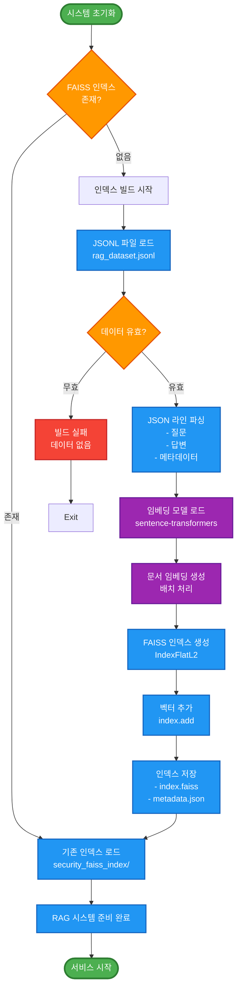

# ColScan - 플로우차트 (Flowchart)

## 시스템 처리 흐름 다이어그램

---

## 1️⃣ QR 코드 스캔 → URL 분석 플로우차트

```mermaid
flowchart TD
    Start([사용자 앱 실행]) --> CheckSession{세션 존재?}
    CheckSession -->|없음| CreateGuest[guest_id 생성<br/>UUID 할당]
    CheckSession -->|있음| LoadSession[세션 로드]
    CreateGuest --> AppHome[앱 홈 화면]
    LoadSession --> AppHome
    
    AppHome --> ScanQR[QR 스캔 버튼 클릭]
    ScanQR --> CameraOpen[카메라 활성화]
    CameraOpen --> QRDetect{QR 코드 감지?}
    
    QRDetect -->|감지 실패| RetryOrCancel{재시도?}
    RetryOrCancel -->|재시도| CameraOpen
    RetryOrCancel -->|취소| AppHome
    
    QRDetect -->|감지 성공| ExtractURL[URL 추출]
    ExtractURL --> ValidURL{유효한 URL?}
    
    ValidURL -->|무효| ShowError1[에러 메시지:<br/>유효하지 않은 URL]
    ShowError1 --> AppHome
    
    ValidURL -->|유효| SendToServer[Flask 서버로<br/>POST /scan/analyze]
    
    SendToServer --> ServerReceive[서버: 요청 수신]
    ServerReceive --> CheckCache{DB 캐시<br/>확인}
    
    CheckCache -->|캐시 있음<br/>24시간 이내| ReturnCached[캐시 결과 반환]
    CheckCache -->|캐시 없음| PreprocessURL[URL 전처리]
    
    PreprocessURL --> TokenizeURL[URL-BERT<br/>토큰화]
    TokenizeURL --> LoadModel{모델 로드됨?}
    
    LoadModel -->|아니오| LoadURLBERT[URL-BERT 모델<br/>메모리 로드]
    LoadURLBERT --> RunInference
    LoadModel -->|예| RunInference[추론 실행]
    
    RunInference --> GetPrediction[예측 결과 획득:<br/>safe/dangerous]
    GetPrediction --> CalculateConfidence[신뢰도 계산<br/>0.0 ~ 1.0]
    
    CalculateConfidence --> SaveToDB[결과를 MySQL 저장<br/>url_scans 테이블]
    SaveToDB --> FormatResponse[JSON 응답 생성]
    
    ReturnCached --> ClientReceive
    FormatResponse --> ClientReceive[클라이언트: 결과 수신]
    
    ClientReceive --> IsDangerous{위험한 URL?}
    
    IsDangerous -->|안전| ShowSafe["✅ 안전 표시<br/>초록색 체크마크"]
    IsDangerous -->|위험| ShowDanger["❌ 위험 표시<br/>빨간색 경고"]
    
    ShowDanger --> ARWarning[AR 오버레이<br/>경고 메시지]
    ARWarning --> LogHistory1
    ShowSafe --> LogHistory1[이력에 저장]
    
    LogHistory1 --> UserChoice{사용자 선택}
    UserChoice -->|홈으로| AppHome
    UserChoice -->|재스캔| ScanQR
    UserChoice -->|이력 보기| ViewHistory[이력 화면 이동]
    UserChoice -->|챗봇 질문| ChatbotFlow[챗봇 플로우로 이동]

    %% 스타일링
    classDef startEnd fill:#4caf50,stroke:#2e7d32,stroke-width:3px,color:#fff
    classDef process fill:#2196f3,stroke:#1565c0,stroke-width:2px,color:#fff
    classDef decision fill:#ff9800,stroke:#e65100,stroke-width:2px,color:#fff
    classDef danger fill:#f44336,stroke:#c62828,stroke-width:2px,color:#fff
    classDef safe fill:#4caf50,stroke:#2e7d32,stroke-width:2px,color:#fff
    classDef error fill:#9e9e9e,stroke:#424242,stroke-width:2px

    class Start,UserChoice startEnd
    class CameraOpen,ExtractURL,SendToServer,PreprocessURL,TokenizeURL,RunInference,GetPrediction,SaveToDB,FormatResponse,ClientReceive process
    class CheckSession,QRDetect,RetryOrCancel,ValidURL,CheckCache,LoadModel,IsDangerous decision
    class ShowDanger,ARWarning danger
    class ShowSafe safe
    class ShowError1 error
```



---

## 2️⃣ AI 챗봇 대화 플로우차트

```mermaid
flowchart TD
    Start([챗봇 화면 진입]) --> InitChat[채팅 인터페이스 로드]
    InitChat --> WaitInput[사용자 입력 대기]
    
    WaitInput --> UserInput{사용자 입력?}
    UserInput -->|입력 없음| WaitInput
    UserInput -->|입력 있음| ValidInput{빈 문자열?}
    
    ValidInput -->|예| ShowWarning[입력 필요 메시지]
    ShowWarning --> WaitInput
    
    ValidInput -->|아니오| SendMessage[Flask 서버로<br/>POST /chatbot/ask]
    
    SendMessage --> ServerReceive[서버: 메시지 수신]
    ServerReceive --> InitAgent[Langchain Agent 초기화]
    
    InitAgent --> ParseInput[입력 텍스트 분석]
    ParseInput --> DetectIntent{의도 파악}
    
    DetectIntent -->|URL 포함| URLPath[URL 분석 경로]
    DetectIntent -->|보안 개념 질문| RAGPath[RAG 검색 경로]
    DetectIntent -->|일반 대화| ChatPath[일반 대화 경로]
    
    subgraph URLAnalysis["URL 분석 경로"]
        URLPath --> ExtractURLs[URL 추출<br/>정규식 매칭]
        ExtractURLs --> CallURLBERT[URLBERTTool 호출]
        CallURLBERT --> URLBERTModel[URL-BERT 모델 추론]
        URLBERTModel --> URLResult[위험도 분석 결과]
        URLResult --> FormatURLResponse[응답 포맷팅<br/>"이 URL은 위험합니다"]
    end
    
    subgraph RAGSearch["RAG 검색 경로"]
        RAGPath --> EmbedQuery[질문 임베딩 생성]
        EmbedQuery --> SearchFAISS[FAISS 인덱스 검색<br/>Top-K 문서 추출]
        SearchFAISS --> CheckResults{관련 문서 발견?}
        CheckResults -->|없음| NoContext[컨텍스트 없이 LLM 호출]
        CheckResults -->|있음| BuildContext[컨텍스트 구성<br/>문서 + 질문]
        BuildContext --> CallLLM[Llama-3-Korean 호출]
        NoContext --> CallLLM
        CallLLM --> GenerateAnswer[답변 생성]
    end
    
    subgraph GeneralChat["일반 대화 경로"]
        ChatPath --> DirectLLM[Llama-3-Korean<br/>직접 호출]
        DirectLLM --> SimplifiedPrompt[간단한 프롬프트<br/>"User: {query}"]
        SimplifiedPrompt --> GenerateResponse[자연어 응답 생성]
    end
    
    FormatURLResponse --> FinalAnswer
    GenerateAnswer --> FinalAnswer
    GenerateResponse --> FinalAnswer[최종 답변 생성]
    
    FinalAnswer --> PostProcess[후처리<br/>- 특수문자 제거<br/>- 길이 제한]
    PostProcess --> LogChat[DB 로그 저장<br/>chat_logs 테이블]
    
    LogChat --> ReturnResponse[JSON 응답 반환]
    ReturnResponse --> DisplayMessage[클라이언트:<br/>메시지 표시]
    
    DisplayMessage --> UpdateHistory[채팅 기록 업데이트<br/>UI 스크롤]
    UpdateHistory --> WaitInput
    
    %% 예외 처리
    ServerReceive -.->|서버 에러| ErrorHandler[에러 핸들러]
    CallURLBERT -.->|모델 로드 실패| ErrorHandler
    SearchFAISS -.->|인덱스 없음| ErrorHandler
    CallLLM -.->|생성 실패| ErrorHandler
    
    ErrorHandler --> ErrorResponse["⚠️ 에러 메시지 반환<br/>죄송합니다. 처리 중 오류가 발생했습니다."]
    ErrorResponse --> DisplayMessage

    %% 스타일링
    classDef startEnd fill:#4caf50,stroke:#2e7d32,stroke-width:3px,color:#fff
    classDef process fill:#2196f3,stroke:#1565c0,stroke-width:2px,color:#fff
    classDef decision fill:#ff9800,stroke:#e65100,stroke-width:2px,color:#fff
    classDef ai fill:#9c27b0,stroke:#6a1b9a,stroke-width:2px,color:#fff
    classDef error fill:#f44336,stroke:#c62828,stroke-width:2px,color:#fff

    class Start startEnd
    class InitChat,SendMessage,ServerReceive,ParseInput,LogChat,ReturnResponse,DisplayMessage,UpdateHistory process
    class UserInput,ValidInput,DetectIntent,CheckResults decision
    class URLBERTModel,CallLLM,GenerateAnswer,GenerateResponse,FinalAnswer ai
    class ErrorHandler,ErrorResponse error
```

---

## 3️⃣ 이력 조회 플로우차트

```mermaid
flowchart TD
    Start([이력 화면 진입]) --> CheckAuth{로그인 상태?}
    
    CheckAuth -->|비로그인<br/>guest| UseGuestID[guest_id 사용]
    CheckAuth -->|로그인| UseUserID[user_id 사용]
    
    UseGuestID --> FetchHistory
    UseUserID --> FetchHistory[Flask 서버로<br/>GET /history]
    
    FetchHistory --> ServerAuth[서버: 세션 검증]
    ServerAuth --> ValidSession{세션 유효?}
    
    ValidSession -->|무효| ReturnUnauth[401 Unauthorized]
    ReturnUnauth --> RedirectLogin[로그인 화면으로]
    
    ValidSession -->|유효| QueryDB[MySQL 쿼리 실행<br/>SELECT * FROM scan_history<br/>WHERE user_id = ?]
    
    QueryDB --> CheckData{데이터 존재?}
    
    CheckData -->|없음| EmptyState[빈 상태 표시<br/>"아직 스캔 이력이 없습니다"]
    EmptyState --> ShowEmptyUI[빈 화면 UI]
    
    CheckData -->|있음| SortData[데이터 정렬<br/>최신순 timestamp DESC]
    SortData --> FormatList[리스트 포맷팅<br/>- URL<br/>- 결과 (안전/위험)<br/>- 시간]
    
    FormatList --> ReturnJSON[JSON 배열 반환]
    ReturnJSON --> ClientRender[클라이언트: 리스트 렌더링]
    
    ClientRender --> DisplayList["목록 표시<br/>✅ 안전: 초록색<br/>❌ 위험: 빨간색"]
    
    DisplayList --> UserAction{사용자 액션?}
    
    UserAction -->|항목 클릭| ShowDetail[상세 정보 모달<br/>- URL 전체<br/>- 신뢰도<br/>- 시간]
    ShowDetail --> DetailAction{상세 액션?}
    
    DetailAction -->|재스캔| RescanURL[해당 URL 재분석]
    RescanURL --> QRFlow[QR 스캔 플로우로]
    
    DetailAction -->|공유| ShareURL[공유 기능<br/>외부 앱 호출]
    ShareURL --> DisplayList
    
    DetailAction -->|삭제| ConfirmDelete{삭제 확인?}
    ConfirmDelete -->|취소| DisplayList
    ConfirmDelete -->|확인| DeleteRecord[DELETE FROM scan_history<br/>WHERE id = ?]
    DeleteRecord --> RefreshList[목록 새로고침]
    RefreshList --> FetchHistory
    
    DetailAction -->|닫기| DisplayList
    
    UserAction -->|새로고침| FetchHistory
    UserAction -->|전체 삭제| ConfirmDeleteAll{전체 삭제 확인?}
    
    ConfirmDeleteAll -->|취소| DisplayList
    ConfirmDeleteAll -->|확인| DeleteAll[DELETE FROM scan_history<br/>WHERE user_id = ?]
    DeleteAll --> ShowEmptyUI
    
    UserAction -->|뒤로가기| End([앱 홈으로])
    ShowEmptyUI --> UserAction

    %% 스타일링
    classDef startEnd fill:#4caf50,stroke:#2e7d32,stroke-width:3px,color:#fff
    classDef process fill:#2196f3,stroke:#1565c0,stroke-width:2px,color:#fff
    classDef decision fill:#ff9800,stroke:#e65100,stroke-width:2px,color:#fff
    classDef db fill:#00bcd4,stroke:#006064,stroke-width:2px,color:#fff
    classDef warning fill:#ff5722,stroke:#bf360c,stroke-width:2px,color:#fff

    class Start,End startEnd
    class UseGuestID,UseUserID,FetchHistory,ServerAuth,QueryDB,SortData,FormatList,ClientRender,DisplayList,RefreshList process
    class CheckAuth,ValidSession,CheckData,UserAction,DetailAction,ConfirmDelete,ConfirmDeleteAll decision
    class QueryDB,DeleteRecord,DeleteAll db
    class ReturnUnauth,ConfirmDeleteAll warning
```

---

## 4️⃣ 사용자 인증 플로우차트

```mermaid
flowchart TD
    Start([앱 최초 실행]) --> CheckCookie{세션 쿠키<br/>존재?}
    
    CheckCookie -->|없음| GenerateGuest[guest_id 생성<br/>UUID.v4]
    CheckCookie -->|있음| ValidateCookie{쿠키 유효?}
    
    ValidateCookie -->|무효/만료| GenerateGuest
    ValidateCookie -->|유효| LoadUserData[사용자 데이터 로드]
    
    GenerateGuest --> SetCookie[Set-Cookie 응답<br/>flask_auth_session]
    SetCookie --> GuestMode[게스트 모드<br/>제한된 기능]
    
    LoadUserData --> CheckUserType{사용자 타입?}
    CheckUserType -->|guest_id만| GuestMode
    CheckUserType -->|user_id 있음| LoggedInMode[로그인 모드<br/>전체 기능]
    
    GuestMode --> UseApp[앱 사용<br/>스캔/챗봇 가능]
    LoggedInMode --> UseApp
    
    UseApp --> LoginPrompt{로그인 시도?}
    LoginPrompt -->|아니오| ContinueGuest[게스트로 계속]
    ContinueGuest --> UseApp
    
    LoginPrompt -->|예| ShowLoginForm[로그인 폼 표시<br/>- 아이디<br/>- 비밀번호]
    
    ShowLoginForm --> InputCreds[사용자 입력]
    InputCreds --> SubmitLogin[POST /auth/login]
    
    SubmitLogin --> ValidateCredentials{인증 정보<br/>검증}
    
    ValidateCredentials -->|실패| LoginError[에러 메시지<br/>"아이디 또는 비밀번호가 틀립니다"]
    LoginError --> RetryLogin{재시도?}
    RetryLogin -->|예| ShowLoginForm
    RetryLogin -->|아니오| GuestMode
    
    ValidateCredentials -->|성공| CreateSession[세션 생성<br/>user_id 설정]
    CreateSession --> MigrateData[게스트 데이터 마이그레이션<br/>guest_id → user_id]
    
    MigrateData --> UpdateDB[UPDATE scan_history<br/>SET user_id = ?<br/>WHERE guest_id = ?]
    UpdateDB --> SetLoginCookie[로그인 쿠키 갱신<br/>SESSION_PERMANENT=True]
    
    SetLoginCookie --> LoggedInMode
    
    LoggedInMode --> LogoutPrompt{로그아웃?}
    LogoutPrompt -->|아니오| UseApp
    LogoutPrompt -->|예| ConfirmLogout{확인?}
    
    ConfirmLogout -->|취소| LoggedInMode
    ConfirmLogout -->|확인| ClearSession[세션 삭제<br/>session.clear]
    ClearSession --> GenerateNewGuest[새 guest_id 생성]
    GenerateNewGuest --> GuestMode

    %% 스타일링
    classDef startEnd fill:#4caf50,stroke:#2e7d32,stroke-width:3px,color:#fff
    classDef process fill:#2196f3,stroke:#1565c0,stroke-width:2px,color:#fff
    classDef decision fill:#ff9800,stroke:#e65100,stroke-width:2px,color:#fff
    classDef auth fill:#9c27b0,stroke:#6a1b9a,stroke-width:2px,color:#fff
    classDef error fill:#f44336,stroke:#c62828,stroke-width:2px,color:#fff

    class Start startEnd
    class GenerateGuest,SetCookie,LoadUserData,UseApp,InputCreds,CreateSession,MigrateData,UpdateDB,ClearSession,GenerateNewGuest process
    class CheckCookie,ValidateCookie,CheckUserType,LoginPrompt,ValidateCredentials,RetryLogin,LogoutPrompt,ConfirmLogout decision
    class ShowLoginForm,SetLoginCookie,GuestMode,LoggedInMode auth
    class LoginError error
```

---

## 5️⃣ RAG 인덱스 빌드 플로우 (오프라인)



---

## 플로우 요약

| 플로우 | 핵심 단계 | 평균 소요 시간 |
|--------|----------|---------------|
| **QR 스캔 → 분석** | QR 감지 → URL 추출 → URL-BERT 추론 → 결과 표시 | 2-3초 |
| **챗봇 대화** | 질문 입력 → 의도 파악 → 도구 선택 → LLM 생성 → 응답 표시 | 5-10초 |
| **이력 조회** | 세션 검증 → DB 쿼리 → 리스트 렌더링 | 0.5-1초 |
| **사용자 인증** | 로그인 폼 → 인증 → 세션 생성 → 데이터 마이그레이션 | 1-2초 |
| **RAG 인덱스 빌드** | 데이터 로드 → 임베딩 생성 → FAISS 저장 | 1-5분 (1회) |

---

**작성일**: 2025-10-27  
**버전**: 1.0  
**프로젝트**: ColScan - QR Code Security Analysis Platform
