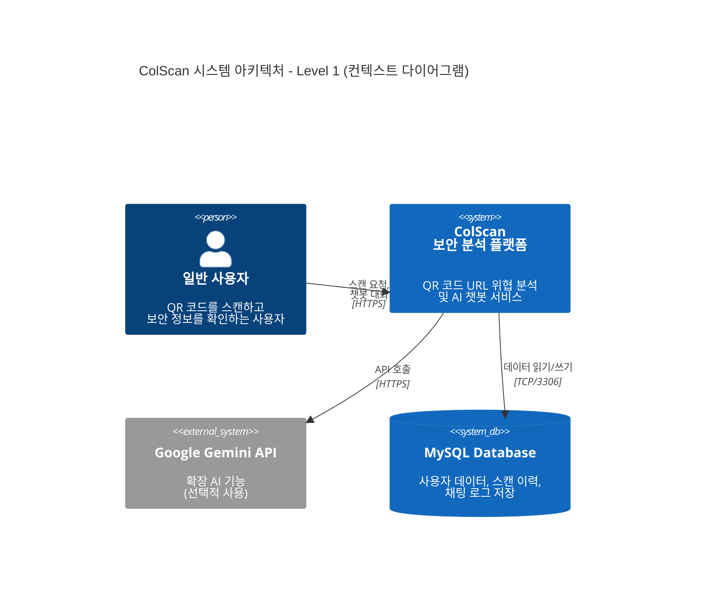
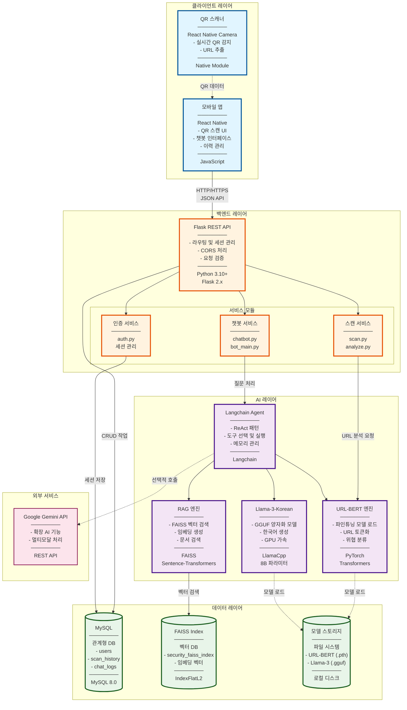
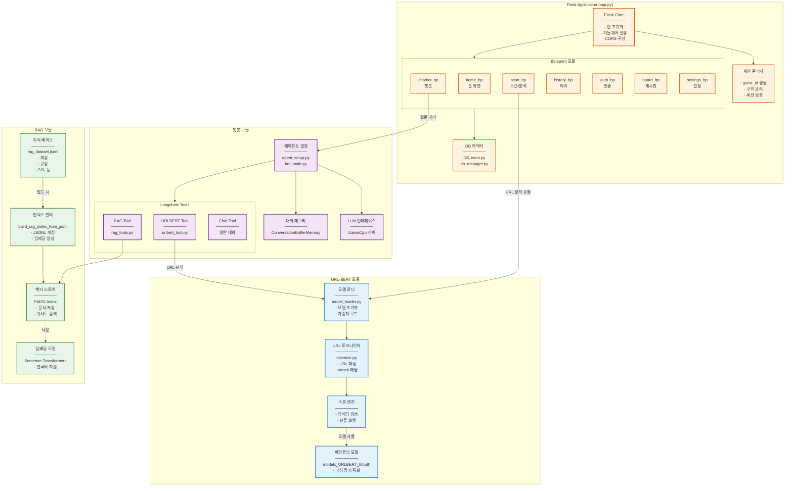
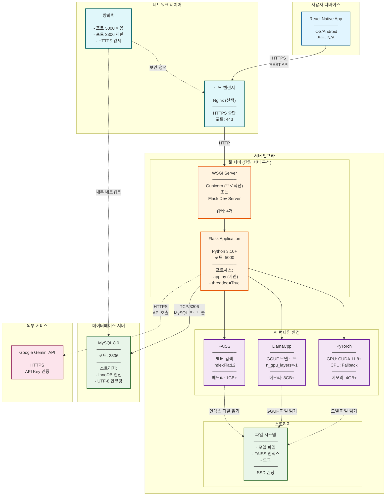
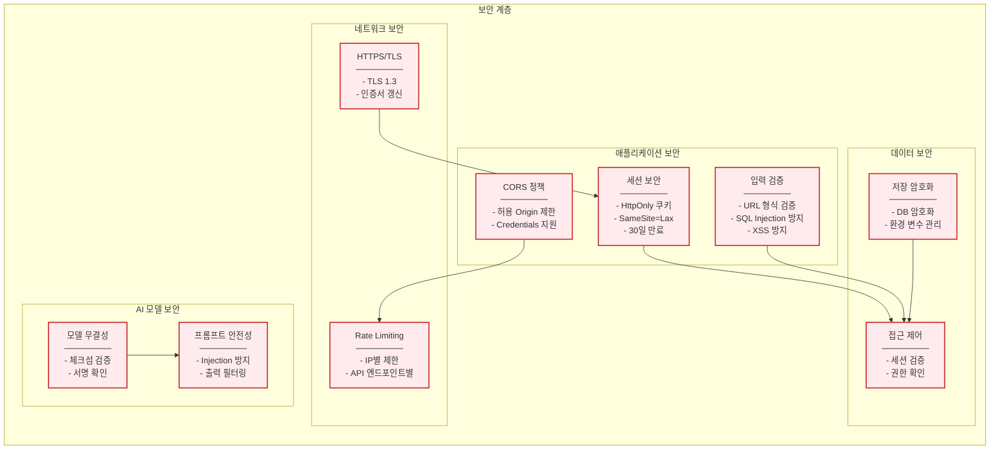
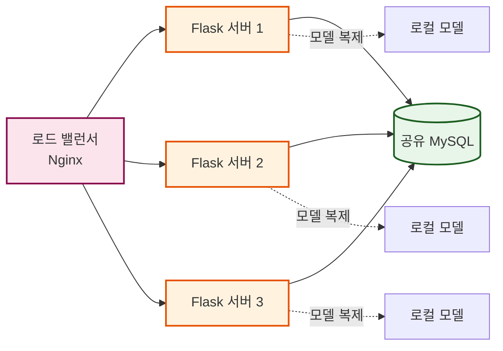
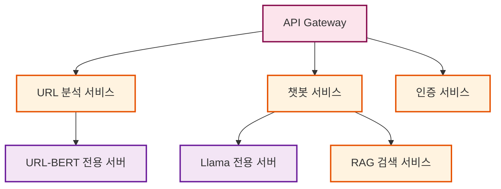
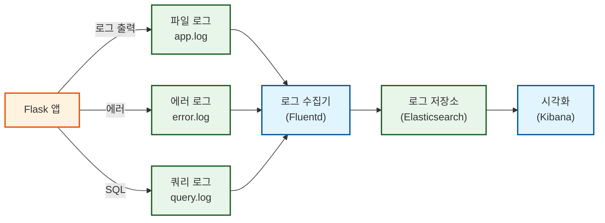

# ColScan - 시스템 아키텍처 (System Architecture)

## 전체 시스템 구성도

---

## 🏗️ 고수준 아키텍처 다이어그램 (High-Level Architecture)



---

## 🎯 컨테이너 다이어그램 (Container Diagram)



---

## 🔧 컴포넌트 다이어그램 (Component Diagram)



---

## 📦 배포 다이어그램 (Deployment Diagram)



---

## 🔐 보안 아키텍처



---

## 📊 기술 스택 상세

### 프론트엔드 (클라이언트)
| 기술 | 버전 | 역할 |
|------|------|------|
| **React Native** | 0.70+ | 크로스 플랫폼 모바일 앱 프레임워크 |
| **JavaScript** | ES2020+ | 프로그래밍 언어 |
| **React Native Camera** | - | QR 코드 스캔 및 카메라 제어 |
| **Axios** | 1.x | HTTP 클라이언트 |

---

### 백엔드 (서버)
| 기술 | 버전 | 역할 |
|------|------|------|
| **Flask** | 2.3+ | 웹 프레임워크 |
| **Python** | 3.10+ | 프로그래밍 언어 |
| **Flask-CORS** | 4.x | Cross-Origin 요청 처리 |
| **Gunicorn** | 20.x | WSGI 서버 (프로덕션) |
| **MySQL Connector** | 8.x | MySQL 클라이언트 |

---

### AI/ML 레이어
| 기술 | 버전 | 역할 |
|------|------|------|
| **PyTorch** | 2.0+ | 딥러닝 프레임워크 |
| **Transformers** | 4.30+ | URL-BERT 모델 인터페이스 |
| **Langchain** | 0.1+ | LLM 오케스트레이션 |
| **LlamaCpp** | - | GGUF 모델 추론 엔진 |
| **FAISS** | 1.7+ | 벡터 유사도 검색 |
| **Sentence-Transformers** | 2.2+ | 임베딩 생성 |

---

### 데이터베이스
| 기술 | 버전 | 역할 |
|------|------|------|
| **MySQL** | 8.0+ | 관계형 데이터베이스 |
| **InnoDB** | - | 스토리지 엔진 |

---

### 외부 API
| 서비스 | 용도 |
|--------|------|
| **Google Gemini API** | 확장 AI 기능 (선택적) |

---

## 🚀 성능 특성

### 시스템 요구사항

#### 서버 최소 사양
```yaml
CPU: 4 Core (8 Thread 권장)
RAM: 16GB (AI 모델 로드 시)
GPU: NVIDIA RTX 3060 이상 (선택, 추론 속도 5-10배 향상)
Storage: 50GB SSD
Network: 100Mbps
```

#### 모델 메모리 사용량
```yaml
URL-BERT (PyTorch):    ~500MB
Llama-3-Korean (GGUF): ~5GB (Q4 양자화)
FAISS Index:           ~200MB (10만 문서 기준)
Flask 프로세스:         ~200MB
총계:                  ~6GB
```

---

### 처리 성능 (단일 서버)

| 작업 | 평균 응답 시간 | 처리량 (TPS) |
|------|---------------|-------------|
| **URL 분석** | 1-2초 | 10-20 req/s |
| **챗봇 응답** | 3-8초 | 2-5 req/s |
| **이력 조회** | 0.1-0.5초 | 50-100 req/s |
| **RAG 검색** | 0.5-1초 | 20-30 req/s |

---

## 🔄 확장성 전략

### 수평 확장 (Horizontal Scaling)


**장점:**
- 트래픽 분산
- 고가용성 (HA)
- 무중단 배포

**과제:**
- 모델 파일 동기화 (각 서버 5GB+)
- 세션 공유 (Redis 사용 권장)

---

### 마이크로서비스 분리 (향후 개선)


---

## 📈 모니터링 및 로깅

### 로깅 아키텍처


---

## 🛡️ 재해 복구 (Disaster Recovery)

### 백업 전략
```yaml
데이터베이스:
  - 일일 전체 백업 (3:00 AM)
  - 시간별 증분 백업
  - 보관 기간: 30일

모델 파일:
  - 버전 관리 (Git LFS)
  - S3/클라우드 스토리지 백업

FAISS 인덱스:
  - 주간 백업
  - 재생성 가능 (JSONL 기반)
```

---

**작성일**: 2025-10-27  
**버전**: 1.0  
**프로젝트**: ColScan - QR Code Security Analysis Platform
