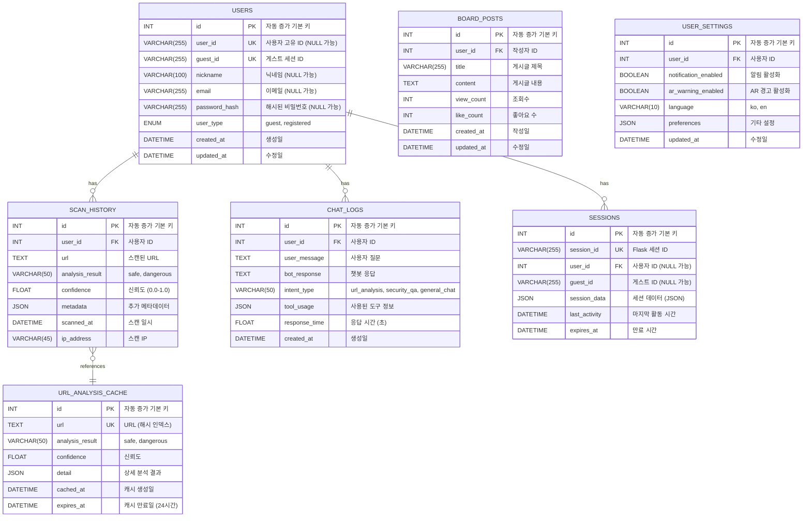

# ColScan - 데이터베이스 스키마 (Database Schema)

## 📊 MySQL 데이터베이스 설계

---

## ER 다이어그램 (Entity-Relationship Diagram)



---

## 테이블 상세 스키마

### 1️⃣ USERS (사용자 정보)

```sql
CREATE TABLE users (
    id INT AUTO_INCREMENT PRIMARY KEY,
    user_id VARCHAR(255) UNIQUE DEFAULT NULL COMMENT '로그인 사용자 고유 ID',
    guest_id VARCHAR(255) UNIQUE NOT NULL COMMENT '게스트 세션 ID (UUID)',
    nickname VARCHAR(100) DEFAULT NULL COMMENT '사용자 닉네임',
    email VARCHAR(255) UNIQUE DEFAULT NULL COMMENT '이메일 (로그인 시)',
    password_hash VARCHAR(255) DEFAULT NULL COMMENT 'bcrypt 해시',
    user_type ENUM('guest', 'registered') DEFAULT 'guest' COMMENT '사용자 타입',
    created_at DATETIME DEFAULT CURRENT_TIMESTAMP COMMENT '가입일',
    updated_at DATETIME DEFAULT CURRENT_TIMESTAMP ON UPDATE CURRENT_TIMESTAMP COMMENT '수정일',
    
    INDEX idx_user_id (user_id),
    INDEX idx_guest_id (guest_id),
    INDEX idx_email (email)
) ENGINE=InnoDB DEFAULT CHARSET=utf8mb4 COLLATE=utf8mb4_unicode_ci COMMENT='사용자 및 게스트 정보';
```

**필드 설명**:
- `user_id`: 로그인 후 할당되는 영구 ID (NULL 가능)
- `guest_id`: 앱 첫 실행 시 생성되는 임시 ID (UUID)
- `user_type`: 게스트(`guest`) 또는 등록 사용자(`registered`)

**데이터 예시**:
```sql
INSERT INTO users (user_id, guest_id, nickname, user_type) VALUES
('user_20251027_001', 'a1b2c3d4-e5f6-7890-abcd-ef1234567890', 'Alice', 'registered'),
(NULL, 'f9e8d7c6-b5a4-3210-9876-543210fedcba', NULL, 'guest');
```

---

### 2️⃣ SCAN_HISTORY (스캔 이력)

```sql
CREATE TABLE scan_history (
    id INT AUTO_INCREMENT PRIMARY KEY,
    user_id INT NOT NULL COMMENT '사용자 FK (users.id)',
    url TEXT NOT NULL COMMENT '스캔된 URL',
    analysis_result VARCHAR(50) NOT NULL COMMENT 'safe 또는 dangerous',
    confidence FLOAT DEFAULT 0.0 COMMENT '신뢰도 (0.0 ~ 1.0)',
    metadata JSON DEFAULT NULL COMMENT '추가 정보 (JSON)',
    scanned_at DATETIME DEFAULT CURRENT_TIMESTAMP COMMENT '스캔 일시',
    ip_address VARCHAR(45) DEFAULT NULL COMMENT '클라이언트 IP',
    
    FOREIGN KEY (user_id) REFERENCES users(id) ON DELETE CASCADE,
    INDEX idx_user_id (user_id),
    INDEX idx_scanned_at (scanned_at),
    INDEX idx_analysis_result (analysis_result)
) ENGINE=InnoDB DEFAULT CHARSET=utf8mb4 COLLATE=utf8mb4_unicode_ci COMMENT='QR 스캔 이력';
```

**필드 설명**:
- `analysis_result`: `'safe'` (안전) 또는 `'dangerous'` (위험)
- `confidence`: URL-BERT 모델의 신뢰도 점수
- `metadata`: 도메인, 프로토콜 등 추가 정보 (JSON)

**데이터 예시**:
```sql
INSERT INTO scan_history (user_id, url, analysis_result, confidence, metadata) VALUES
(1, 'https://google.com', 'safe', 0.98, '{"domain": "google.com", "protocol": "https"}'),
(2, 'http://phishing-site.xyz', 'dangerous', 0.92, '{"domain": "phishing-site.xyz", "protocol": "http"}');
```

---

### 3️⃣ CHAT_LOGS (챗봇 대화 로그)

```sql
CREATE TABLE chat_logs (
    id INT AUTO_INCREMENT PRIMARY KEY,
    user_id INT NOT NULL COMMENT '사용자 FK (users.id)',
    user_message TEXT NOT NULL COMMENT '사용자 질문',
    bot_response TEXT NOT NULL COMMENT '챗봇 응답',
    intent_type VARCHAR(50) DEFAULT NULL COMMENT 'url_analysis, security_qa, general_chat',
    tool_usage JSON DEFAULT NULL COMMENT '사용된 도구 정보',
    response_time FLOAT DEFAULT 0.0 COMMENT '응답 생성 시간 (초)',
    created_at DATETIME DEFAULT CURRENT_TIMESTAMP COMMENT '대화 일시',
    
    FOREIGN KEY (user_id) REFERENCES users(id) ON DELETE CASCADE,
    INDEX idx_user_id (user_id),
    INDEX idx_created_at (created_at),
    INDEX idx_intent_type (intent_type)
) ENGINE=InnoDB DEFAULT CHARSET=utf8mb4 COLLATE=utf8mb4_unicode_ci COMMENT='챗봇 대화 로그';
```

**필드 설명**:
- `intent_type`: 질문 의도 분류
  - `url_analysis`: URL 위협 분석
  - `security_qa`: 보안 개념 질문
  - `general_chat`: 일반 대화
- `tool_usage`: Langchain에서 사용한 도구 정보 (JSON)
  ```json
  {
    "tool": "URLBERT_ThreatAnalyzer",
    "input": "https://example.com",
    "output": "safe"
  }
  ```

**데이터 예시**:
```sql
INSERT INTO chat_logs (user_id, user_message, bot_response, intent_type, tool_usage, response_time) VALUES
(1, '큐싱이 뭐야?', 'QR 코드를 이용한 피싱 공격입니다...', 'security_qa', '{"tool": "RAGTool", "documents": 3}', 2.34),
(2, 'https://toss.im 안전해?', '이 URL은 안전합니다.', 'url_analysis', '{"tool": "URLBERT", "result": "safe", "confidence": 0.95}', 1.87);
```

---

### 4️⃣ SESSIONS (세션 관리)

```sql
CREATE TABLE sessions (
    id INT AUTO_INCREMENT PRIMARY KEY,
    session_id VARCHAR(255) UNIQUE NOT NULL COMMENT 'Flask 세션 ID',
    user_id INT DEFAULT NULL COMMENT '로그인 사용자 FK (NULL 가능)',
    guest_id VARCHAR(255) DEFAULT NULL COMMENT '게스트 ID (NULL 가능)',
    session_data JSON DEFAULT NULL COMMENT '세션 데이터',
    last_activity DATETIME DEFAULT CURRENT_TIMESTAMP ON UPDATE CURRENT_TIMESTAMP COMMENT '마지막 활동',
    expires_at DATETIME NOT NULL COMMENT '세션 만료 시간',
    
    FOREIGN KEY (user_id) REFERENCES users(id) ON DELETE CASCADE,
    INDEX idx_session_id (session_id),
    INDEX idx_expires_at (expires_at),
    INDEX idx_last_activity (last_activity)
) ENGINE=InnoDB DEFAULT CHARSET=utf8mb4 COLLATE=utf8mb4_unicode_ci COMMENT='사용자 세션';
```

**필드 설명**:
- `session_id`: Flask가 생성한 세션 ID (쿠키)
- `session_data`: 세션에 저장된 커스텀 데이터
- `expires_at`: 30일 후 자동 만료

**세션 정리 쿼리** (크론잡):
```sql
DELETE FROM sessions WHERE expires_at < NOW();
```

---

### 5️⃣ URL_ANALYSIS_CACHE (URL 분석 캐시)

```sql
CREATE TABLE url_analysis_cache (
    id INT AUTO_INCREMENT PRIMARY KEY,
    url TEXT NOT NULL COMMENT '분석된 URL',
    url_hash VARCHAR(64) UNIQUE NOT NULL COMMENT 'SHA256 해시',
    analysis_result VARCHAR(50) NOT NULL COMMENT 'safe 또는 dangerous',
    confidence FLOAT DEFAULT 0.0 COMMENT '신뢰도',
    detail JSON DEFAULT NULL COMMENT '상세 분석 결과',
    cached_at DATETIME DEFAULT CURRENT_TIMESTAMP COMMENT '캐시 생성 시간',
    expires_at DATETIME NOT NULL COMMENT '캐시 만료 시간 (24시간 후)',
    
    INDEX idx_url_hash (url_hash),
    INDEX idx_expires_at (expires_at)
) ENGINE=InnoDB DEFAULT CHARSET=utf8mb4 COLLATE=utf8mb4_unicode_ci COMMENT='URL 분석 결과 캐시';
```

**사용 목적**:
- 동일 URL 재스캔 시 모델 추론 생략 (성능 최적화)
- 24시간 캐시 유지 후 자동 만료

**URL 해시 생성 예시** (Python):
```python
import hashlib

def hash_url(url: str) -> str:
    return hashlib.sha256(url.encode('utf-8')).hexdigest()
```

**캐시 조회 쿼리**:
```sql
SELECT * FROM url_analysis_cache 
WHERE url_hash = SHA2('https://example.com', 256) 
  AND expires_at > NOW();
```

---

### 6️⃣ BOARD_POSTS (게시판)

```sql
CREATE TABLE board_posts (
    id INT AUTO_INCREMENT PRIMARY KEY,
    user_id INT NOT NULL COMMENT '작성자 FK',
    title VARCHAR(255) NOT NULL COMMENT '제목',
    content TEXT NOT NULL COMMENT '내용',
    view_count INT DEFAULT 0 COMMENT '조회수',
    like_count INT DEFAULT 0 COMMENT '좋아요 수',
    created_at DATETIME DEFAULT CURRENT_TIMESTAMP COMMENT '작성일',
    updated_at DATETIME DEFAULT CURRENT_TIMESTAMP ON UPDATE CURRENT_TIMESTAMP COMMENT '수정일',
    
    FOREIGN KEY (user_id) REFERENCES users(id) ON DELETE CASCADE,
    INDEX idx_user_id (user_id),
    INDEX idx_created_at (created_at),
    FULLTEXT INDEX idx_title_content (title, content)
) ENGINE=InnoDB DEFAULT CHARSET=utf8mb4 COLLATE=utf8mb4_unicode_ci COMMENT='커뮤니티 게시판';
```

---

### 7️⃣ USER_SETTINGS (사용자 설정)

```sql
CREATE TABLE user_settings (
    id INT AUTO_INCREMENT PRIMARY KEY,
    user_id INT UNIQUE NOT NULL COMMENT '사용자 FK',
    notification_enabled BOOLEAN DEFAULT TRUE COMMENT '알림 활성화',
    ar_warning_enabled BOOLEAN DEFAULT TRUE COMMENT 'AR 경고 활성화',
    language VARCHAR(10) DEFAULT 'ko' COMMENT '언어 (ko, en)',
    preferences JSON DEFAULT NULL COMMENT '기타 설정',
    updated_at DATETIME DEFAULT CURRENT_TIMESTAMP ON UPDATE CURRENT_TIMESTAMP COMMENT '수정일',
    
    FOREIGN KEY (user_id) REFERENCES users(id) ON DELETE CASCADE
) ENGINE=InnoDB DEFAULT CHARSET=utf8mb4 COLLATE=utf8mb4_unicode_ci COMMENT='사용자 설정';
```

---

## 인덱스 전략

### 복합 인덱스 (Composite Index)
```sql
-- scan_history: 사용자별 최근 스캔 조회
CREATE INDEX idx_user_scanned ON scan_history(user_id, scanned_at DESC);

-- chat_logs: 사용자별 최근 대화 조회
CREATE INDEX idx_user_chat ON chat_logs(user_id, created_at DESC);

-- sessions: 세션 만료 정리
CREATE INDEX idx_expires ON sessions(expires_at);
```

---

## 데이터 마이그레이션

### 게스트 → 등록 사용자 마이그레이션
```sql
-- 1. users 테이블에서 user_id 할당
UPDATE users 
SET user_id = 'user_20251027_new', 
    user_type = 'registered',
    nickname = 'NewUser',
    email = 'user@example.com',
    password_hash = '$2b$12$...'
WHERE guest_id = 'a1b2c3d4-e5f6-7890-abcd-ef1234567890';

-- 2. scan_history 마이그레이션 (이미 FK로 연결됨, 추가 작업 불필요)

-- 3. chat_logs 마이그레이션 (이미 FK로 연결됨, 추가 작업 불필요)
```

---

## 데이터베이스 백업 및 복구

### 백업 스크립트
```bash
#!/bin/bash
# 데이터베이스 백업 스크립트

DB_NAME="colscan_db"
BACKUP_DIR="/var/backups/mysql"
TIMESTAMP=$(date +"%Y%m%d_%H%M%S")

mysqldump -u root -p${DB_PASSWORD} \
  --single-transaction \
  --quick \
  --lock-tables=false \
  ${DB_NAME} > ${BACKUP_DIR}/colscan_backup_${TIMESTAMP}.sql

# 압축
gzip ${BACKUP_DIR}/colscan_backup_${TIMESTAMP}.sql

# 30일 이전 백업 삭제
find ${BACKUP_DIR} -name "colscan_backup_*.sql.gz" -mtime +30 -delete
```

### 복구 스크립트
```bash
#!/bin/bash
# 데이터베이스 복구 스크립트

DB_NAME="colscan_db"
BACKUP_FILE=$1

if [ -z "$BACKUP_FILE" ]; then
    echo "Usage: $0 <backup_file.sql.gz>"
    exit 1
fi

# 압축 해제
gunzip -c ${BACKUP_FILE} | mysql -u root -p${DB_PASSWORD} ${DB_NAME}

echo "복구 완료: ${BACKUP_FILE}"
```

---

## 데이터베이스 초기화 스크립트

### `init_db.sql`
```sql
-- 데이터베이스 생성
CREATE DATABASE IF NOT EXISTS colscan_db CHARACTER SET utf8mb4 COLLATE utf8mb4_unicode_ci;
USE colscan_db;

-- 모든 테이블 생성 (위 스키마 참조)
-- ... (전체 CREATE TABLE 구문)

-- 초기 데이터 삽입 (선택)
INSERT INTO users (guest_id, user_type) VALUES 
('system-guest', 'guest');

-- 관리자 계정 생성 (선택)
INSERT INTO users (user_id, nickname, email, password_hash, user_type) VALUES
('admin', 'Administrator', 'admin@colscan.com', '$2b$12$...', 'registered');
```

---

## 성능 최적화 팁

### 1. 쿼리 최적화
```sql
-- ❌ 느린 쿼리 (전체 테이블 스캔)
SELECT * FROM scan_history WHERE url LIKE '%example.com%';

-- ✅ 빠른 쿼리 (인덱스 활용)
SELECT * FROM scan_history WHERE user_id = 1 ORDER BY scanned_at DESC LIMIT 10;
```

### 2. 파티셔닝 (대용량 데이터)
```sql
-- chat_logs를 월별로 파티셔닝
ALTER TABLE chat_logs PARTITION BY RANGE (YEAR(created_at) * 100 + MONTH(created_at)) (
    PARTITION p202510 VALUES LESS THAN (202511),
    PARTITION p202511 VALUES LESS THAN (202512),
    PARTITION p202512 VALUES LESS THAN (202601)
);
```

### 3. 캐시 테이블 정리 (크론잡)
```bash
# /etc/cron.daily/cleanup_cache.sh
#!/bin/bash
mysql -u root -p${DB_PASSWORD} colscan_db -e "DELETE FROM url_analysis_cache WHERE expires_at < NOW();"
mysql -u root -p${DB_PASSWORD} colscan_db -e "DELETE FROM sessions WHERE expires_at < NOW();"
```

---

**작성일**: 2025-10-27  
**버전**: 1.0  
**프로젝트**: ColScan - QR Code Security Analysis Platform
