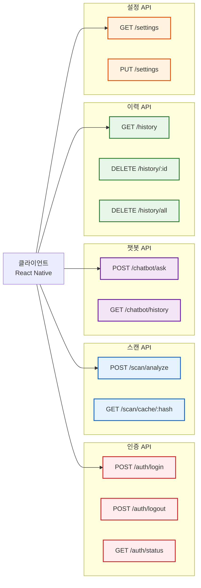
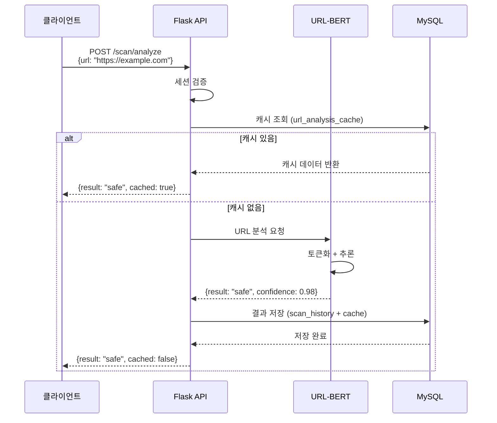
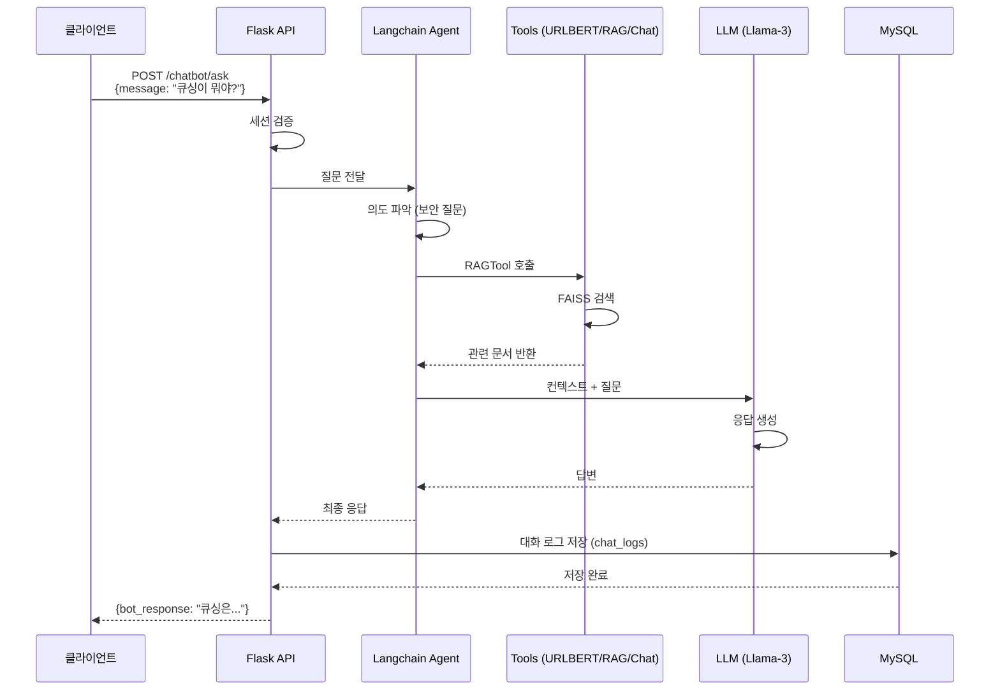

# ColScan - API 명세서 (API Specification)

## 🌐 REST API 문서

**Base URL**: `http://localhost:5000` (개발 환경)  
**프로덕션 URL**: `https://api.colscan.com` (예정)

---

## 📑 목차

1. [인증 API](#1-인증-api)
2. [스캔 API](#2-스캔-api)
3. [챗봇 API](#3-챗봇-api)
4. [이력 API](#4-이력-api)
5. [사용자 설정 API](#5-사용자-설정-api)
6. [에러 코드](#6-에러-코드)

---

## API 엔드포인트 개요



---

## 1. 인증 API

### 1.1 로그인

**엔드포인트**: `POST /auth/login`

**설명**: 사용자 로그인 및 세션 생성

**요청**:
```http
POST /auth/login HTTP/1.1
Host: localhost:5000
Content-Type: application/json

{
  "email": "user@example.com",
  "password": "securePassword123"
}
```

**응답** (성공):
```json
{
  "status": "success",
  "message": "로그인 성공",
  "data": {
    "user_id": "user_20251027_001",
    "nickname": "Alice",
    "email": "user@example.com",
    "user_type": "registered"
  }
}
```

**응답** (실패):
```json
{
  "status": "error",
  "message": "이메일 또는 비밀번호가 틀렸습니다",
  "code": "AUTH_FAILED"
}
```

**상태 코드**:
- `200 OK`: 로그인 성공
- `401 Unauthorized`: 인증 실패
- `400 Bad Request`: 잘못된 요청

---

### 1.2 로그아웃

**엔드포인트**: `POST /auth/logout`

**설명**: 세션 삭제 및 로그아웃

**요청**:
```http
POST /auth/logout HTTP/1.1
Host: localhost:5000
Cookie: flask_auth_session=eyJndWVzdF9pZCI6ImExYjJjM...
```

**응답**:
```json
{
  "status": "success",
  "message": "로그아웃 성공"
}
```

---

### 1.3 세션 상태 확인

**엔드포인트**: `GET /auth/status`

**설명**: 현재 세션 상태 조회

**요청**:
```http
GET /auth/status HTTP/1.1
Host: localhost:5000
Cookie: flask_auth_session=eyJndWVzdF9pZCI6ImExYjJjM...
```

**응답**:
```json
{
  "status": "success",
  "data": {
    "is_logged_in": true,
    "user_id": "user_20251027_001",
    "guest_id": null,
    "nickname": "Alice",
    "user_type": "registered"
  }
}
```

---

## 2. 스캔 API

### 2.1 URL 분석 (핵심 API)

**엔드포인트**: `POST /scan/analyze`

**설명**: QR 코드에서 추출한 URL의 위협성 분석

**요청**:
```http
POST /scan/analyze HTTP/1.1
Host: localhost:5000
Content-Type: application/json
Cookie: flask_auth_session=eyJndWVzdF9pZCI6ImExYjJjM...

{
  "url": "https://example.com",
  "use_cache": true
}
```

**요청 파라미터**:
| 필드 | 타입 | 필수 | 설명 |
|------|------|------|------|
| `url` | string | ✅ | 분석할 URL |
| `use_cache` | boolean | ❌ | 캐시 사용 여부 (기본값: `true`) |

**응답** (안전한 URL):
```json
{
  "status": "success",
  "data": {
    "url": "https://example.com",
    "analysis_result": "safe",
    "confidence": 0.987,
    "details": {
      "domain": "example.com",
      "protocol": "https",
      "has_ssl": true,
      "model_version": "urlbert_80_v1"
    },
    "cached": false,
    "analyzed_at": "2025-10-27T12:34:56Z"
  }
}
```

**응답** (위험한 URL):
```json
{
  "status": "success",
  "data": {
    "url": "http://phishing-site.xyz",
    "analysis_result": "dangerous",
    "confidence": 0.923,
    "warning_message": "⚠️ 피싱 사이트로 의심됩니다. 접속을 권장하지 않습니다.",
    "details": {
      "domain": "phishing-site.xyz",
      "protocol": "http",
      "has_ssl": false,
      "suspicious_patterns": ["비정상적인 도메인", "HTTP 프로토콜"]
    },
    "cached": false,
    "analyzed_at": "2025-10-27T12:35:10Z"
  }
}
```

**상태 코드**:
- `200 OK`: 분석 성공
- `400 Bad Request`: 잘못된 URL 형식
- `500 Internal Server Error`: 모델 추론 오류

---

### 2.2 캐시 조회

**엔드포인트**: `GET /scan/cache/:url_hash`

**설명**: 이전에 분석된 URL 캐시 조회

**요청**:
```http
GET /scan/cache/a1b2c3d4e5f6... HTTP/1.1
Host: localhost:5000
```

**응답**:
```json
{
  "status": "success",
  "data": {
    "url": "https://example.com",
    "analysis_result": "safe",
    "confidence": 0.987,
    "cached_at": "2025-10-27T10:00:00Z",
    "expires_at": "2025-10-28T10:00:00Z"
  }
}
```

---

## 3. 챗봇 API

### 3.1 질문하기

**엔드포인트**: `POST /chatbot/ask`

**설명**: AI 챗봇에게 질문하고 응답 받기

**요청**:
```http
POST /chatbot/ask HTTP/1.1
Host: localhost:5000
Content-Type: application/json
Cookie: flask_auth_session=eyJndWVzdF9pZCI6ImExYjJjM...

{
  "message": "큐싱이 뭐야?"
}
```

**요청 파라미터**:
| 필드 | 타입 | 필수 | 설명 |
|------|------|------|------|
| `message` | string | ✅ | 사용자 질문 (최대 1000자) |

**응답** (보안 질문):
```json
{
  "status": "success",
  "data": {
    "user_message": "큐싱이 뭐야?",
    "bot_response": "큐싱(QRishing)은 QR 코드를 이용한 피싱 공격입니다. 공격자가 악성 QR 코드를 생성하여 사용자를 피싱 사이트로 유도하는 방식입니다.",
    "intent_type": "security_qa",
    "tool_used": "RAGTool",
    "response_time": 2.34,
    "created_at": "2025-10-27T12:40:00Z"
  }
}
```

**응답** (URL 분석):
```json
{
  "status": "success",
  "data": {
    "user_message": "https://toss.im 안전해?",
    "bot_response": "이 URL은 안전합니다. 신뢰도: 95%",
    "intent_type": "url_analysis",
    "tool_used": "URLBERT_ThreatAnalyzer",
    "analysis_result": {
      "url": "https://toss.im",
      "result": "safe",
      "confidence": 0.95
    },
    "response_time": 1.87,
    "created_at": "2025-10-27T12:41:00Z"
  }
}
```

**상태 코드**:
- `200 OK`: 응답 생성 성공
- `400 Bad Request`: 빈 메시지
- `500 Internal Server Error`: LLM 생성 오류

---

### 3.2 대화 이력 조회

**엔드포인트**: `GET /chatbot/history`

**설명**: 사용자의 챗봇 대화 이력 조회

**요청**:
```http
GET /chatbot/history?limit=20&offset=0 HTTP/1.1
Host: localhost:5000
Cookie: flask_auth_session=eyJndWVzdF9pZCI6ImExYjJjM...
```

**쿼리 파라미터**:
| 필드 | 타입 | 필수 | 설명 |
|------|------|------|------|
| `limit` | integer | ❌ | 가져올 대화 수 (기본값: 20) |
| `offset` | integer | ❌ | 시작 위치 (기본값: 0) |

**응답**:
```json
{
  "status": "success",
  "data": {
    "total": 45,
    "chats": [
      {
        "id": 123,
        "user_message": "큐싱이 뭐야?",
        "bot_response": "큐싱(QRishing)은...",
        "intent_type": "security_qa",
        "created_at": "2025-10-27T12:40:00Z"
      },
      {
        "id": 122,
        "user_message": "https://toss.im 안전해?",
        "bot_response": "이 URL은 안전합니다.",
        "intent_type": "url_analysis",
        "created_at": "2025-10-27T12:35:00Z"
      }
    ]
  }
}
```

---

## 4. 이력 API

### 4.1 스캔 이력 조회

**엔드포인트**: `GET /history`

**설명**: 사용자의 QR 스캔 이력 조회

**요청**:
```http
GET /history?limit=50&sort=desc HTTP/1.1
Host: localhost:5000
Cookie: flask_auth_session=eyJndWVzdF9pZCI6ImExYjJjM...
```

**쿼리 파라미터**:
| 필드 | 타입 | 필수 | 설명 |
|------|------|------|------|
| `limit` | integer | ❌ | 가져올 이력 수 (기본값: 50) |
| `sort` | string | ❌ | 정렬 방식 (`asc`, `desc`, 기본값: `desc`) |
| `filter` | string | ❌ | 필터 (`all`, `safe`, `dangerous`, 기본값: `all`) |

**응답**:
```json
{
  "status": "success",
  "data": {
    "total": 127,
    "history": [
      {
        "id": 456,
        "url": "https://google.com",
        "analysis_result": "safe",
        "confidence": 0.98,
        "scanned_at": "2025-10-27T11:00:00Z"
      },
      {
        "id": 455,
        "url": "http://phishing-site.xyz",
        "analysis_result": "dangerous",
        "confidence": 0.92,
        "scanned_at": "2025-10-27T10:30:00Z"
      }
    ]
  }
}
```

---

### 4.2 특정 이력 삭제

**엔드포인트**: `DELETE /history/:id`

**설명**: 특정 스캔 이력 삭제

**요청**:
```http
DELETE /history/456 HTTP/1.1
Host: localhost:5000
Cookie: flask_auth_session=eyJndWVzdF9pZCI6ImExYjJjM...
```

**응답**:
```json
{
  "status": "success",
  "message": "이력이 삭제되었습니다"
}
```

---

### 4.3 전체 이력 삭제

**엔드포인트**: `DELETE /history/all`

**설명**: 사용자의 모든 스캔 이력 삭제

**요청**:
```http
DELETE /history/all HTTP/1.1
Host: localhost:5000
Cookie: flask_auth_session=eyJndWVzdF9pZCI6ImExYjJjM...
```

**응답**:
```json
{
  "status": "success",
  "message": "127개 이력이 삭제되었습니다"
}
```

---

## 5. 사용자 설정 API

### 5.1 설정 조회

**엔드포인트**: `GET /settings`

**설명**: 사용자 설정 조회

**요청**:
```http
GET /settings HTTP/1.1
Host: localhost:5000
Cookie: flask_auth_session=eyJndWVzdF9pZCI6ImExYjJjM...
```

**응답**:
```json
{
  "status": "success",
  "data": {
    "notification_enabled": true,
    "ar_warning_enabled": true,
    "language": "ko",
    "preferences": {
      "theme": "light",
      "auto_scan": false
    }
  }
}
```

---

### 5.2 설정 업데이트

**엔드포인트**: `PUT /settings`

**설명**: 사용자 설정 변경

**요청**:
```http
PUT /settings HTTP/1.1
Host: localhost:5000
Content-Type: application/json
Cookie: flask_auth_session=eyJndWVzdF9pZCI6ImExYjJjM...

{
  "notification_enabled": false,
  "language": "en"
}
```

**응답**:
```json
{
  "status": "success",
  "message": "설정이 업데이트되었습니다",
  "data": {
    "notification_enabled": false,
    "ar_warning_enabled": true,
    "language": "en",
    "preferences": {
      "theme": "light",
      "auto_scan": false
    }
  }
}
```

---

## 6. 에러 코드

| 코드 | HTTP 상태 | 설명 | 해결 방법 |
|------|-----------|------|----------|
| `AUTH_FAILED` | 401 | 인증 실패 | 올바른 이메일/비밀번호 입력 |
| `SESSION_EXPIRED` | 401 | 세션 만료 | 다시 로그인 |
| `INVALID_URL` | 400 | 잘못된 URL 형식 | URL 형식 확인 |
| `EMPTY_MESSAGE` | 400 | 빈 메시지 | 메시지 입력 필요 |
| `MODEL_ERROR` | 500 | AI 모델 오류 | 서버 관리자에게 문의 |
| `DB_ERROR` | 500 | 데이터베이스 오류 | 잠시 후 재시도 |
| `RATE_LIMIT_EXCEEDED` | 429 | 요청 제한 초과 | 1분 후 재시도 |

**공통 에러 응답 형식**:
```json
{
  "status": "error",
  "message": "에러 메시지",
  "code": "ERROR_CODE",
  "timestamp": "2025-10-27T12:00:00Z"
}
```

---

## 7. 시퀀스 다이어그램 (API 호출 흐름)

### 7.1 URL 분석 시퀀스



### 7.2 챗봇 대화 시퀀스



---

## 8. 인증 및 세션 관리

### 세션 쿠키
```http
Set-Cookie: flask_auth_session=eyJndWVzdF9pZCI6ImExYjJjM...; 
            HttpOnly; 
            SameSite=Lax; 
            Max-Age=2592000; 
            Path=/
```

**속성**:
- `HttpOnly`: JavaScript 접근 불가 (XSS 방지)
- `SameSite=Lax`: CSRF 방지
- `Max-Age=2592000`: 30일 유지

---

## 9. Rate Limiting

| 엔드포인트 | 제한 | 기간 |
|-----------|------|------|
| `/scan/analyze` | 60 req | 1분 |
| `/chatbot/ask` | 30 req | 1분 |
| `/auth/login` | 5 req | 5분 |

**초과 시 응답**:
```json
{
  "status": "error",
  "message": "요청 제한을 초과했습니다. 잠시 후 다시 시도해주세요.",
  "code": "RATE_LIMIT_EXCEEDED",
  "retry_after": 60
}
```

---

**작성일**: 2025-10-27  
**버전**: 1.0  
**프로젝트**: ColScan - QR Code Security Analysis Platform
