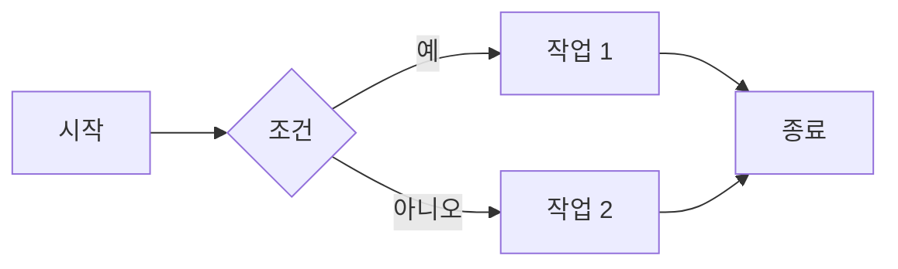

# ColScan 시스템 다이어그램 문서

## 📚 문서 개요

이 폴더는 **ColScan (QR Code Security Analysis Platform)** 프로젝트의 전체 시스템 구조를 시각적으로 설명하는 다이어그램 모음입니다.

---

## 📋 문서 목록

| 파일명 | 내용 | 주요 대상 |
|--------|------|----------|
| **01_data_flow_diagram.md** | 데이터 플로우 다이어그램 | 개발자, 데이터 엔지니어 |
| **02_flowchart.md** | 기능별 플로우차트 | 개발자, QA 엔지니어 |
| **03_system_architecture.md** | 시스템 아키텍처 | 아키텍트, 인프라 엔지니어 |
| **04_database_schema.md** | 데이터베이스 스키마 (추가 예정) | DB 관리자 |
| **05_api_specification.md** | API 명세서 (추가 예정) | 프론트엔드 개발자 |

---

## 🎯 각 다이어그램 설명

### 1️⃣ 데이터 플로우 다이어그램 (Data Flow Diagram)
**파일**: `01_data_flow_diagram.md`

**목적**: 시스템 내 데이터의 흐름을 추적하고 이해

**주요 내용**:
- QR 코드 스캔 → URL 분석 데이터 흐름
- AI 챗봇 대화 데이터 처리
- RAG (검색 증강 생성) 파이프라인
- 세션 및 이력 관리
- MySQL 데이터 저장/조회 흐름

**누가 봐야 하나요?**
- 백엔드 개발자: API 데이터 처리 로직 이해
- 데이터 엔지니어: 데이터 파이프라인 설계
- QA 엔지니어: 테스트 시나리오 작성

**핵심 다이어그램**:
```
모바일 앱 → Flask API → URL-BERT 모델 → MySQL → 응답 반환
                    ↓
              Langchain Agent → RAG/LLM → 챗봇 응답
```

---

### 2️⃣ 플로우차트 (Flowchart)
**파일**: `02_flowchart.md`

**목적**: 각 기능의 단계별 처리 흐름을 상세하게 표현

**주요 내용**:
- **QR 스캔 플로우**: 스캔 → URL 추출 → 분석 → 결과 표시
- **챗봇 대화 플로우**: 입력 → 의도 파악 → 도구 선택 → 응답 생성
- **이력 조회 플로우**: 세션 검증 → DB 쿼리 → 리스트 표시
- **사용자 인증 플로우**: 로그인/로그아웃 → 세션 관리
- **RAG 인덱스 빌드 플로우**: 데이터 로드 → 임베딩 → FAISS 저장

**누가 봐야 하나요?**
- 프론트엔드 개발자: UI/UX 플로우 이해
- QA 엔지니어: 테스트 케이스 작성
- 프로덕트 매니저: 기능 흐름 검토

**특징**:
- 의사결정 포인트 명확 표시
- 에러 처리 경로 포함
- 사용자 액션 및 시스템 응답 구분

---

### 3️⃣ 시스템 아키텍처 (System Architecture)
**파일**: `03_system_architecture.md`

**목적**: 전체 시스템의 구조적 설계 및 컴포넌트 관계 표현

**주요 내용**:
- **고수준 아키텍처**: 시스템 컨텍스트 다이어그램 (C4 Level 1)
- **컨테이너 다이어그램**: 주요 컨테이너 및 기술 스택
- **컴포넌트 다이어그램**: Flask 모듈, AI 엔진, RAG 시스템 구조
- **배포 다이어그램**: 서버 인프라 및 네트워크 구성
- **보안 아키텍처**: 보안 계층 및 방어 메커니즘
- **성능 특성**: 시스템 요구사항 및 확장성 전략

**누가 봐야 하나요?**
- 솔루션 아키텍트: 시스템 설계 의사결정
- 인프라 엔지니어: 배포 및 운영 계획
- CTO/기술 리더: 기술 스택 검토
- DevOps 엔지니어: CI/CD 파이프라인 설계

**핵심 기술 스택**:
```yaml
Frontend: React Native (JavaScript)
Backend: Flask (Python 3.10+)
AI/ML: PyTorch, Langchain, Llama-3-Korean, URL-BERT
Database: MySQL 8.0, FAISS (Vector DB)
External: Google Gemini API (선택적)
```

---

## 🔍 다이어그램 활용 가이드

### 개발 단계별 활용

#### 1. 요구사항 분석 단계
- **플로우차트** 먼저 검토
- 사용자 시나리오별 흐름 파악
- 예외 케이스 및 에러 처리 확인

#### 2. 설계 단계
- **시스템 아키텍처** 참조
- 컴포넌트 간 책임 분리
- 기술 스택 및 의존성 확인

#### 3. 구현 단계
- **데이터 플로우 다이어그램** 활용
- API 엔드포인트 및 데이터 모델 설계
- 데이터 변환 및 검증 로직 구현

#### 4. 테스트 단계
- **플로우차트** 기반 테스트 시나리오 작성
- 각 의사결정 포인트에서 분기 테스트
- 통합 테스트 시 **데이터 플로우** 검증

#### 5. 배포 단계
- **배포 다이어그램** 참조
- 서버 인프라 구성
- 성능 모니터링 설정

---

## 🛠️ 다이어그램 수정 방법

### Mermaid 문법 사용
모든 다이어그램은 **Mermaid.js** 문법으로 작성되어 있습니다.

#### 온라인 에디터
- [Mermaid Live Editor](https://mermaid.live)
- GitHub 마크다운에서 직접 렌더링 가능

#### 로컬 렌더링
```bash
# VSCode 확장 설치
code --install-extension bierner.markdown-mermaid

# 또는 CLI 도구
npm install -g @mermaid-js/mermaid-cli
mmdc -i diagram.md -o diagram.png
```

#### 수정 예시


---

## 📊 시스템 메트릭 요약

### 성능 지표
| 메트릭 | 값 | 목표 |
|--------|-----|------|
| **URL 분석 응답 시간** | 1-2초 | < 3초 |
| **챗봇 응답 시간** | 3-8초 | < 10초 |
| **동시 접속자** | 100명 | 500명 (확장 시) |
| **일일 스캔 처리** | 10,000건 | 50,000건 |
| **DB 쓰기 지연** | < 100ms | < 200ms |

### 시스템 신뢰성
```yaml
가용성: 99.5% (월 3.6시간 다운타임 허용)
데이터 정확도: 95%+ (URL-BERT 분류 정확도)
모델 업타임: 99.9% (메모리 상주)
```

---

## 🔐 보안 고려사항

### 다이어그램에서 확인할 보안 요소

1. **데이터 플로우 다이어그램**
   - HTTPS/TLS 암호화 경로
   - 세션 쿠키 보안 설정
   - SQL Injection 방지 지점

2. **플로우차트**
   - 인증/인가 검증 단계
   - 입력 검증 및 새니타이징
   - 에러 메시지 노출 제어

3. **시스템 아키텍처**
   - 방화벽 규칙
   - API 키 관리
   - 모델 무결성 검증

---

## 📖 추가 리소스

### 프로젝트 문서
- **메인 README**: `/README.md` (프로젝트 루트)
- **API 문서**: `/docs/api/` (작성 예정)
- **개발 가이드**: `/docs/development/` (작성 예정)

### 외부 참고 자료
- [Flask 공식 문서](https://flask.palletsprojects.com/)
- [Langchain 문서](https://python.langchain.com/)
- [Mermaid 문법 가이드](https://mermaid.js.org/intro/)
- [URL-BERT 논문](https://arxiv.org/abs/2106.00788)

---

## 🤝 기여 가이드

### 다이어그램 업데이트 시

1. **변경사항 명확히 기록**
   ```markdown
   ## 변경 이력
   - 2025-10-27: 초기 버전 작성
   - YYYY-MM-DD: [변경 내용]
   ```

2. **일관된 스타일 유지**
   - 색상 팔레트 유지
   - 폰트 크기 통일
   - 화살표 스타일 일관성

3. **코드 리뷰 필수**
   - 다이어그램 변경도 PR 생성
   - 팀원 리뷰 후 병합

---

## ❓ FAQ

### Q1. 다이어그램이 GitHub에서 안 보여요
**A**: GitHub는 Mermaid를 지원합니다. 브라우저 캐시를 지우고 새로고침하세요.

### Q2. 다이어그램을 이미지로 내보내고 싶어요
**A**: Mermaid Live Editor에서 PNG/SVG로 내보내기 가능합니다.

### Q3. 새로운 기능 추가 시 다이어그램 업데이트는 필수인가요?
**A**: 예, 시스템 구조에 영향을 주는 변경사항은 반드시 다이어그램도 업데이트해야 합니다.

### Q4. 어떤 다이어그램을 먼저 봐야 하나요?
**A**: 
- 개발자 → **데이터 플로우** + **플로우차트**
- 아키텍트 → **시스템 아키텍처**
- 프로덕트 매니저 → **플로우차트**

---

## 📞 연락처

문서 관련 문의:
- **프로젝트 GitHub**: [dlwl224/colscan](https://github.com/dlwl224/colscan)
- **이슈 트래커**: GitHub Issues 사용

---

**마지막 업데이트**: 2025-10-27  
**작성자**: ColScan Development Team  
**버전**: 1.0.0
